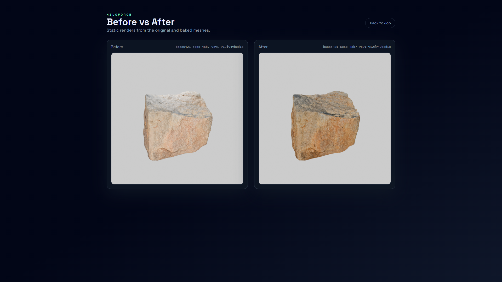
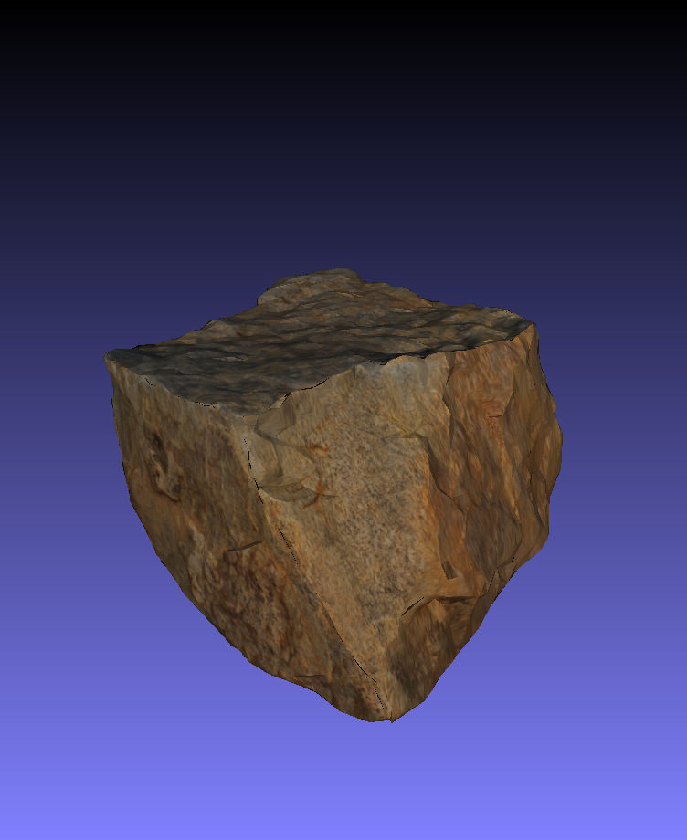
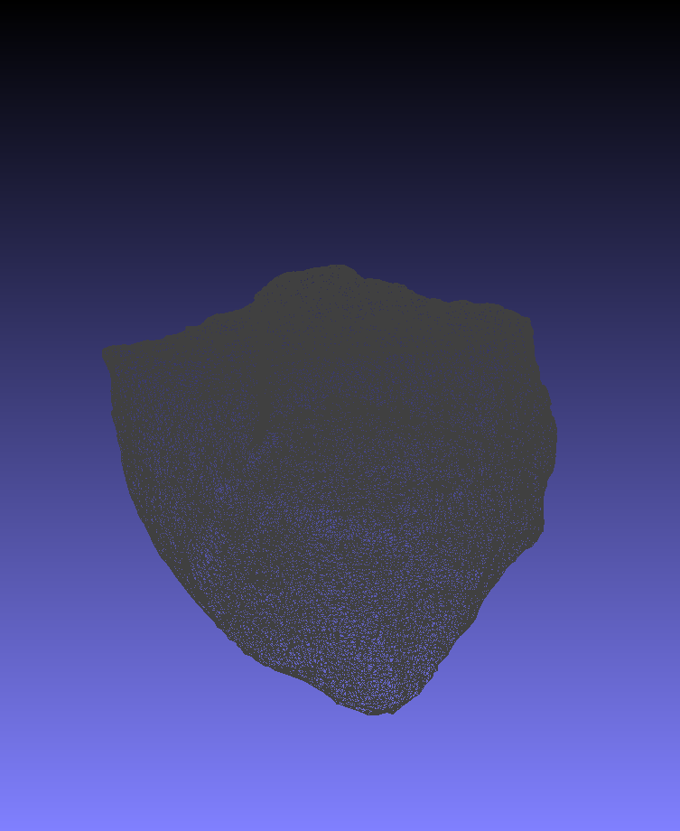
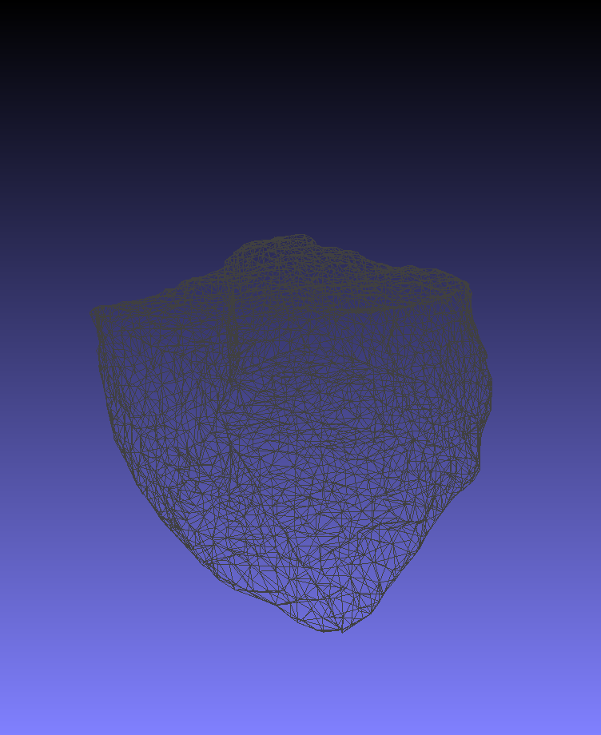

# HiLoForge

HiLoForge is a **full‑stack application** that pipelines high‑poly scans into game‑ready low‑poly assets by baking **base color** and **normal** maps from a high mesh to a decimated low mesh. It runs Blender headless via a worker, exposes an API, and includes a simple web UI.

## Demo
**Home UI**


**Preview UI**



**Video Demo**

<p align="left">
  <a href="https://youtu.be/LP9zZ3jD4C0">
    
  </a>
</p>

Example result from the demo asset:
**64,826 faces → ~5,000 faces (~92% reduction)**

**Before / After (Textures)**

<table>
  <tr>
    <td></td>
    <td></td>
  </tr>
</table>

**Before / After (Wireframe)**

<table>
  <tr>
    <td></td>
    <td></td>
  </tr>
</table>

## Repository Structure
```
/
  api/                # FastAPI service
  worker/             # RQ worker + Blender script
  frontend/           # React + Tailwind UI
  data/               # Runtime data (uploads/outputs)
  test_inputs/        # Sample inputs
  public/             # Demo assets for README
  docker-compose.yml  # Service orchestration
  README.md
```

## Features
- Imports a 3D asset (`.glb/.gltf/.fbx/.obj/.zip`)
- Creates **HIGH** and **LOW** duplicates
- Decimates LOW to a target triangle count
- Unwraps LOW with Smart UV Project
- Bakes **base color** and **normal** maps
- Exports a low‑poly GLB + textures
- Generates **before/after** preview renders

## Tech Stack
- **Frontend**: React + Vite + TypeScript + Tailwind CSS
- **API**: FastAPI (Python)
- **Worker**: RQ + Blender (headless)
- **Queue/Cache**: Redis
- **Containerization**: Docker + Docker Compose

## Endpoints
```
POST /jobs
GET  /jobs/{job_id}
GET  /jobs/{job_id}/download
GET  /jobs/{job_id}/preview/before
GET  /jobs/{job_id}/preview/after
```

## Run (Docker)
```
docker compose up -d --build
```

Open:
- UI: `http://localhost:3000`
- API: `http://localhost:8000`

## Pipeline Parameters (UI → Blender)
**Core**
- **Target Triangles** → Decimate ratio (target / current)
- **Texture Size** → Bake image size
- **Ray Distance** → `Render > Bake > Max Ray Distance`
- **UV Island Margin** → Smart UV Project island margin
- **Bake Margin (px)** → `Render > Bake > Margin`

**Experimental**
- **Cage Extrusion** → `Render > Bake > Cage Extrusion` (requires cage)
- **Shrinkwrap Offset** → Shrinkwrap modifier offset on LOW
- **Remesh Voxel Size** → Voxel Remesh before decimation
- **Auto Smooth Angle** → Auto Smooth angle (0 disables)

## Tips
- If base color bakes are black, **increase Ray Distance** and/or **Cage Extrusion**.
- If you see holes in the low mesh, **raise Target Triangles** and keep **Remesh Voxel Size = 0**.
- For better texture edges, increase **Bake Margin** and **UV Island Margin**.

## Output
Each job writes to:
```
/data/outputs/<output_id>/
  model_low.glb
  textures/atlas_basecolor.png
  textures/atlas_normal.png
  preview_before.png
  preview_after.png
  output.zip
  manifest.txt
```

## Notes
- GPU baking is supported when Docker has GPU access and Blender is configured to use it.
- Some viewers (e.g., MeshLab) may not display GLTF/GLB PBR materials correctly. Try Blender or a WebGL viewer if it appears black.

## Future Improvements
- **Batch processing**: upload and process multiple assets in one job.
- **Multi‑resolution bake**: optional multires workflow for sculpted assets.
- **Multi‑LOD export**: generate LOD0/LOD1/LOD2 with shared textures.
- **Preset system**: save/recall parameter presets per asset type.
- **Quality checks**: detect black bakes and auto‑retry with safer settings.
- **Better viewers**: in‑app GLB preview and side‑by‑side diff viewer.
- **Artifact cleanup**: post‑decimation cleanup (merge by distance, delete loose).
